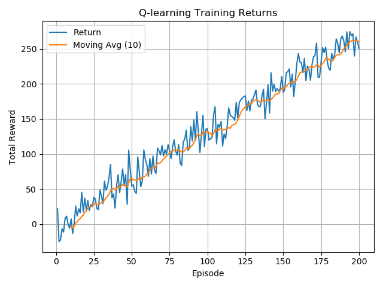
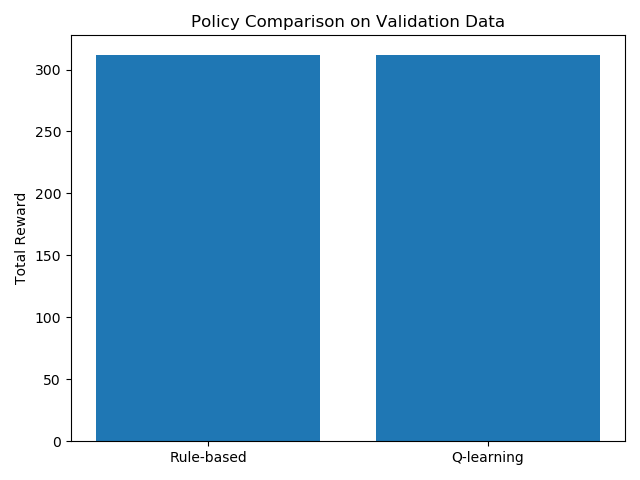

# Road Sound Recording Policy Learning using Q-learning
도로 주행음 기반 녹음 저장 정책 강화학습 프로젝트

---

## 1. 프로젝트 개요


본 프로젝트는 도로변 고정 마이크에서 수집된 주행음 데이터를 기반으로  
"어떤 1초 구간을 저장하고 어떤 구간을 스킵해야 하는지"를 자동으로 결정하는  
녹음 저장 정책(recording policy)을 강화학습(Tabular Q-learning)으로 학습하는 것을 목표로 한다.

데이터는 실제 차량 소리, 배경 소음 등이 포함되어 있으나  
각 구간에 대한 "이 구간이 차량소리인지 아닌지"와 같은 라벨이 제공되지 않는다.  
따라서 RMS 에너지 기반 pseudo-event(가상 이벤트 라벨)을 정의하여 보상 설계에 활용하였다.

---

## 2. 데이터셋 설명

- 녹음 환경: 도로 인근 고정 마이크, 장기간 기록  
- 형식: WAV  
- 샘플레이트: 44.1kHz  
- 10분마다 1개 파일 생성 (약 50MB)

본 프로젝트에서는 다음 두 파일만 사용하였다.

| 용도 | 파일명 |
|------|--------|
| 학습 | road_sound_test1.wav |
| 검증 | road_sound_test2.wav |

---

## 3. 전처리 과정

전처리는 preprocess_audio.py를 통해 수행하였다.

### 전처리 단계
1. WAV 파일 로드  
2. 1초 단위 분할 (44100 샘플)  
3. RMS 에너지 계산  
4. RMS 분포 기반 5개 구간(0~4)으로 디스크리타이즈  
5. 결과 저장  
   - train_bins.npy (길이: 599)  
   - val_bins.npy (길이: 600)

---

## 4. 전처리 결과 검증

check_bins.py를 실행하여 상태 데이터가 정상적으로 생성되었는지 검증하였다.

### 값 범위 및 타입

| 파일 | 최소값 | 최대값 | dtype | 정수형 |
|------|--------|--------|--------|--------|
| train_bins.npy | 0 | 4 | int64 | True |
| val_bins.npy   | 0 | 4 | int64 | True |

### 값 분포

Train (599초):
```
0: 120
1: 120
2: 119
3: 120
4: 120
```

Validation (600초):
```
0: 120
1: 120
2: 120
3: 120
4: 120
```

### 시퀀스 패턴

train 첫 20개:
```
[1 0 0 0 0 0 0 0 0 1 2 3 1 0 0 1 1 2 3 2]
```

val 첫 20개:
```
[3 4 4 4 4 4 4 4 4 3 3 3 3 3 3 3 3 3 2 2]
```

→ 상태 값이 자연스럽고 이상치 없음 (NaN, float 등)

---

## 5. 강화학습 문제 정의

### State
```
energy_bin ∈ {0,1,2,3,4}
```

### Action

| 행동 | 의미 |
|------|------|
| 0 | Skip |
| 1 | Record |

### Reward (pseudo-event 기반)

pseudo-event: energy_bin ≥ 3 → 이벤트로 가정

| Event | Action | Reward |
|--------|--------|---------|
| 1 | Record | +1.0 |
| 1 | Skip | -1.0 |
| 0 | Record | -0.2 |
| 0 | Skip | +0.2 |

---

## 6. 강화학습 알고리즘: Tabular Q-learning

### 하이퍼파라미터
- Q-table 크기: 5 × 2  
- 학습률 α = 0.1  
- 할인율 γ = 0.95  
- ε-greedy 탐색(1.0 → 0.1)  
- 총 200 에피소드

### Q-learning 업데이트 식
```
Q(s,a) ← Q(s,a) + α(r + γ·max Q(s',·) − Q(s,a))
```

---

## 7. 학습 결과

### 학습 곡선


### 에피소드 보상 평균

| 구간 | 평균 Total Reward |
|------|--------------------|
| 초반 20 에피소드 | 7.98 |
| 후반 20 에피소드 | 255.16 |

→ 약 32배 성능 향상 → RL 정책 학습 성공

---

## 8. 학습된 정책(Q-table)

```
state 0 → Skip
state 1 → Skip
state 2 → Skip
state 3 → Record
state 4 → Record
```

### 해석
- 낮은 소리 에너지(0~2) → 저장할 필요 없음 → Skip  
- 높은 소리 에너지(3~4) → 이벤트 가능성 높음 → Record  

→ 보상 설계와 완전히 일치하는 최적 정책

---

## 9. Rule 기반 정책 비교

Rule 정책:
```
if energy_bin ≥ 3: Record else Skip
```

### 비교 결과 (evaluate_policies.py)


```
Rule-based total reward = 312.0
Q-learning total reward = 312.0
```

→ 보상 구조 자체가 Rule 기반 정책을 반영하고 있어  
Q-learning이 자연스럽게 동일 정책으로 수렴함.

→ RL이 pseudo-reward 설계의 타당성을 학습을 통해 검증한 결과로 해석할 수 있음.

---

## 10. 결론

본 프로젝트에서는 RMS 기반 상태 표현과 pseudo-event 보상 구조를 활용해  
도로 주행음 녹음 저장 정책을 강화학습으로 학습하였다.

핵심 성과:
- Tabular Q-learning이 빠르게 안정적으로 수렴  
- 학습된 정책이 보상 설계와 정확히 일치  
- Rule 정책과 같은 수준의 성능 달성  
- 임베디드 환경(Jetson Orin Nano)에서도 가볍게 실행 가능

### 향후 개선 방향
- MFCC, 스펙트럼 기반 특징 추가  
- DQN 등 함수근사 기반 RL 적용  
- 실제 이벤트 라벨 사용한 supervised 학습과 비교  
- 다양한 도로 환경 데이터 추가 학습

---

## 11. 재현(Validation) 명령어

```
python3 preprocess_audio.py
python3 train_qlearning.py
python3 evaluate_policies.py
python3 check_qtable.py
python3 check_bins.py
python3 check_training_stats.py
python3 plot_results.py
```

---

## 12. 프로젝트 구조

```
project-root/
 ├─ README.md
 ├─ roadsound_env.py
 ├─ preprocess_audio.py
 ├─ train_qlearning.py
 ├─ evaluate_policies.py
 ├─ plot_results.py
 ├─ check_env_debug.py
 ├─ check_bins.py
 ├─ check_qtable.py
 ├─ check_training_stats.py
 ├─ train_bins.npy
 ├─ val_bins.npy
 ├─ q_table.npy
 ├─ qlearning_train_returns.npy
 ├─ comparison_results.json
 ├─ training_returns.png
 └─ policy_comparison.png
```

---

# End of README
